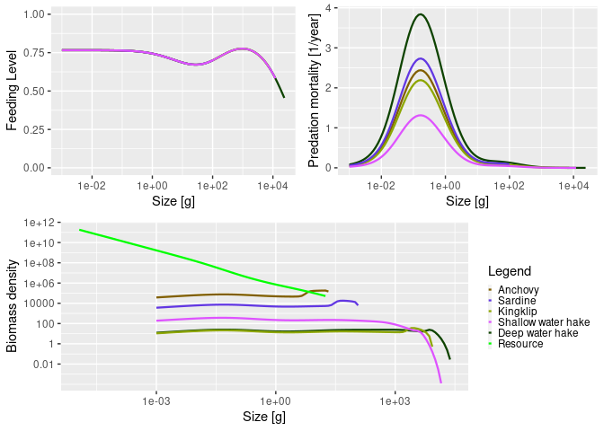

<!-- README.md is generated from README.Rmd. Please edit that file -->

# mizerExamples

<!-- badges: start -->

[](https://www.tidyverse.org/lifecycle/#experimental)
[](https://CRAN.R-project.org/package=mizerExamples)
<!-- badges: end -->

The goal of mizerExamples is to provide mizer users a way to share their
models.

If you have a model to contribute, just email
<gustav.delius@york.ac.uk>.

## Installation

You can install the current version from [GitHub](https://github.com/)
with:

``` r
# install.packages("devtools")
devtools::install_github("sizespectrum/mizerExamples")
```

## Example

``` r
library(mizer)
library(mizerExamples)
plot(Benguela_params)
```


